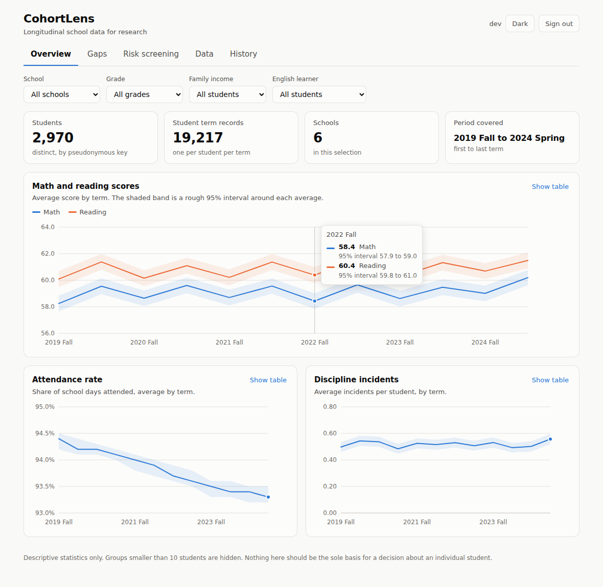

# CohortLens

CohortLens is a research data management tool and longitudinal analytics dashboard for school level education data. It ingests heterogeneous spreadsheet exports, validates and pseudonymizes them, and supports descriptive analysis of student outcomes over time. All data in this repository is synthetic. No real students, schools or districts are represented.



## Problem

Education researchers commonly receive administrative data as spreadsheet exports from several student information systems. Three issues recur before any analysis can begin.

1. **Data quality.** Exports contain missing scores, inconsistent units (attendance recorded as 0.93 in one file and 93 in another), out of range values and duplicate student term records.
2. **Provenance.** Cleaning is often done by hand, so the transformations applied to the data are undocumented. This undermines reproducibility and makes it difficult to defend results.
3. **Privacy.** Direct student identifiers are frequently stored in shared folders, and small subgroups can be re identified when results are reported at fine granularity.

## How I identified the problem

I started from the description of Luddy's Faculty Assistance in Data Science (FADS) program, which lists databases, SQL, data visualization, statistics and Java among its expected competencies. Reading it, I inferred that a common need in faculty research projects is a reliable path from raw administrative data to analysis ready data. I scoped this project to demonstrate that competency on a realistic version of the problem, using synthetic data because real student records cannot be shared.

## Solution

CohortLens addresses each issue directly.

- **Transparent validation.** Every upload produces a report that lists each row as accepted, corrected with a warning, or rejected, together with the reason and the row number. No change is applied silently.
- **Privacy by design.** Student identifiers are replaced on arrival with a keyed hash (HMAC SHA 256) and the originals are never stored. Any subgroup with fewer than 10 students is suppressed in all outputs. Access is role based, and imports and exports are written to an audit log.
- **Descriptive analytics.** The dashboard reports term level trends with approximate 95 percent intervals, subgroup gaps (economic status and English learner status), and a transparent point based risk screening score that lists the reasons behind each score.

## Implementation details

| Component | Description |
|---|---|
| Core logic | Framework independent Java 17 in `com.cohortlens.core`: CSV parser, 21 validation checks, pseudonymizer, analytics service, risk scorer and CSV exporter. Both the Spring application and the development server reuse this code. |
| Backend | Spring Boot 3.3 with JPA, Flyway migrations, PostgreSQL and Spring Security (HTTP Basic, stateless). Roles are Viewer, Researcher and Admin. |
| Dashboard | React 18 and TypeScript in strict mode, built with Vite. Charts are hand built SVG with keyboard navigation, a table view for each chart and a light and dark theme. The color palette was validated for color vision deficiency and contrast. |
| Data | `scripts/generate_synthetic_data.py` produces seeded synthetic records. The `--messy` flag injects roughly 4 percent errors to exercise the validator. |

**Validation rules.** A row is rejected for a missing student or school, a grade outside 0 to 12, an invalid year or term, an unknown category, a score outside 0 to 100, attendance out of range, a negative incident count, a wrong column count, or a repeated student and term pair. A row is retained with a warning when a score or attendance value is blank (left empty), when an incident count is blank (treated as 0), or when attendance appears to be a percentage (divided by 100). An append import rejects keys that already exist, and a replace import clears existing data first. Each import runs in a single transaction, so a failure leaves the previous data unchanged.

**Analytical limitations.** The same student appears in many terms, so observations are not independent and the reported intervals are somewhat too narrow. They should be read as a rough indication of noise, not as formal tests. Gaps are descriptive differences between group means and are not causal estimates. The risk score is a prioritization heuristic, not a validated predictive model. Pseudonymized data remains personal data under most privacy frameworks and should be handled accordingly.

## Results

Running the validator on the messy synthetic file (19,514 rows) gave 19,217 accepted rows, 297 rejected rows and 518 warnings, each documented in the import report. The dashboard recovered the patterns that were planted in the generator: the income gap at one school narrows from about 7 points to about 2, and attendance at another school declines over time.

Verification performed so far:

- 53 JUnit tests for the core logic pass.
- The database schema was applied to PostgreSQL 16, and its constraints rejected every invalid row I tested. 19,440 clean rows loaded successfully.
- The dashboard was exercised in a headless browser (filters, hover, keyboard navigation, upload in both modes, suppression, dark mode and a mobile width). Its production build succeeds and its 6 unit tests pass.

**Limitation of this evaluation.** The Spring Boot layer, the Docker configuration and the H2 development profile were written but not compiled or run, because Maven Central was inaccessible in the environment where I built the project. Run `cd backend && mvn test` before relying on them.

**Future work.** A mixed effects model would account for repeated measures and give more defensible intervals. Other improvements include key rotation for the pseudonymization secret, a correction endpoint with before and after values in the audit log, and university single sign on.

## Running the project

The quickest option needs only a JDK (17 or newer) and Node. It runs the real import and analytics code behind a small in memory server, with no database and no authentication.

```bash
./scripts/run_dev.sh
```

Open http://localhost:5173. The messy sample file is loaded at startup.

To run the Spring Boot application with an in memory database:

```bash
cd backend && mvn spring-boot:run -Dspring-boot.run.profiles=dev
cd frontend && npm install && npm run dev
```

The development credentials are `admin` / `admin-dev`, `researcher` / `researcher-dev` and `viewer` / `viewer-dev`. They exist only in the `dev` profile. For Docker with PostgreSQL (untested), copy `.env.example` to `.env`, set every value, and run `docker compose up --build`.

## Input format

One row per student per term, with the columns `student_id`, `school`, `grade`, `academic_year`, `term` (FALL or SPRING), `economic_status` (LOW_INCOME or NOT_LOW_INCOME), `english_learner` (Y or N), `math_score`, `reading_score`, `attendance_rate` and `discipline_incidents`.
